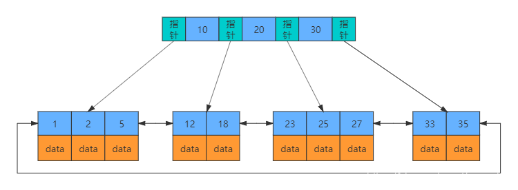
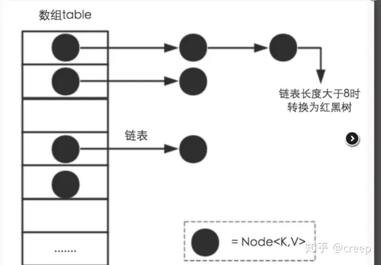
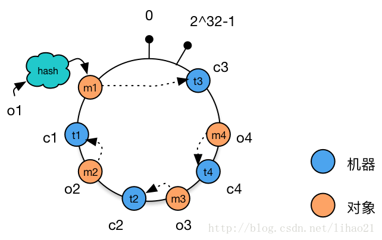
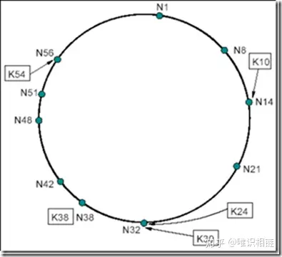
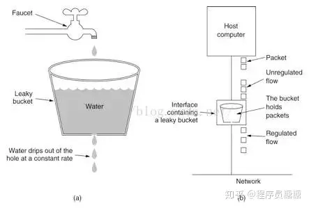
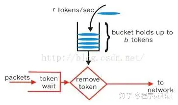
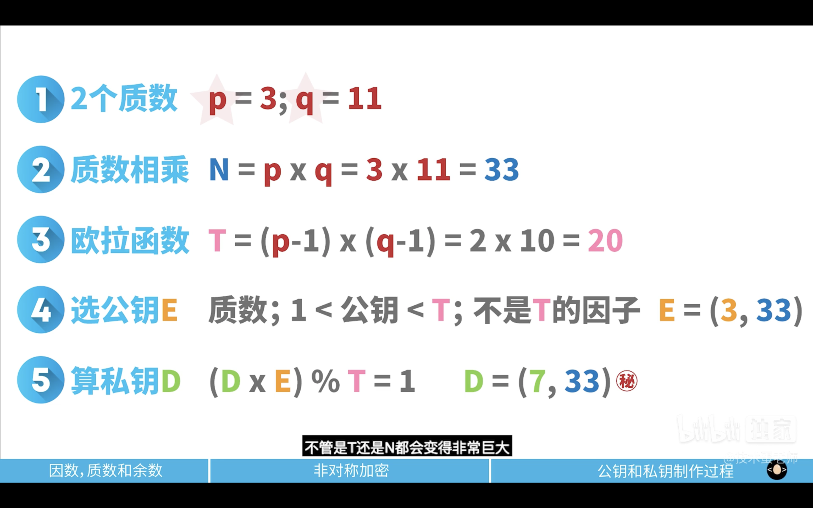
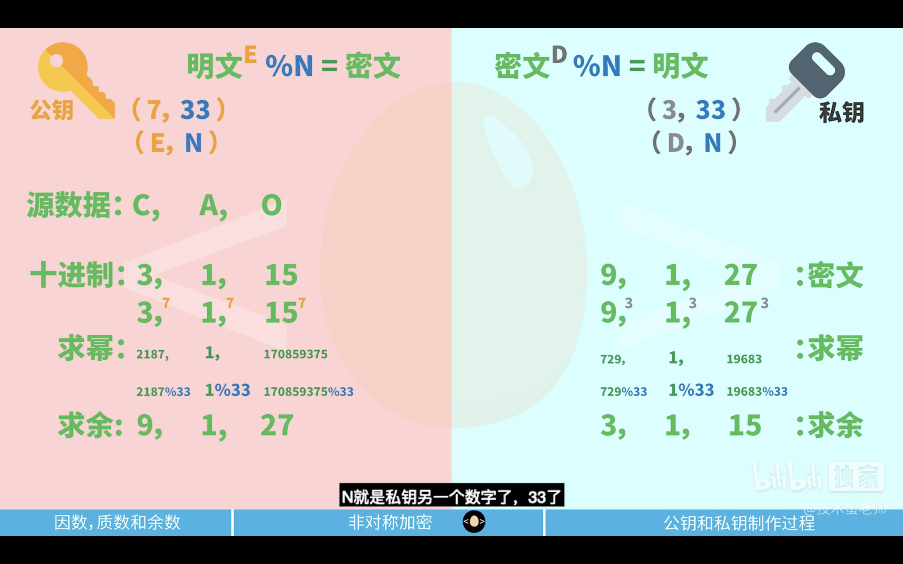

# 工作中遇到的一些算法

## 0. 算法思考与一些思路

### 0.1 寻找量变之间的联系
    > `动态规划`
    > a. 找出最优解的性质，并刻划其结构特征。
    > b. 递归地定义最优值。
    > c. 以自底向上的方式计算出最优值。
    > d. 根据计算最优值时得到的信息，构造最优解

### 0.2 函数式编程

[函数式编程](https://ruanyifeng.com/blog/2017/02/fp-tutorial.html)

+ 可以认为是对函数过程解耦
+ 某个函数功能看成2个子函数功能的迭加
+ 对某个函数给出 map 函数作为应用
> 个人认为没有链式结构方便

### 0.3 幂等性

$$
f(f(x)) = f(x) 
$$

幂等性（Idempotence）是指对同一操作的多次执行所产生的结果与单次执行的结果相同。在计算机科学和分布式系统中，幂等性是一个重要的概念。

### 具备幂等性的操作有以下特点
+ 重复执行不会产生额外的副作用或变化。
+ 多次执行与单次执行的结果相同。

### 幂等性的重要性体现在以下几个方面：
+ 安全性：幂等操作可以保证在不同环境下的安全性。即使操作被重复调用、并发执行或网络中断重新发送时，也能保证系统状态的一致性。
+ 可恢复性：在出现错误或异常情况时，可以通过重试操作来恢复到原始状态。如果操作具备幂等性，则重试操作不会引入任何额外的副作用。
+ 性能优化：幂等性操作允许进行缓存、预加载或批量处理等优化策略。由于多次执行与单次执行的结果相同，可以避免重复计算和重复操作，提高系统的性能和效率。

    参考资料

## 1. Mysql索引

### 1.1 B-Tree索引
B树（Balanced Tree）是一种平衡多路搜索树。它的特点是所有叶子节点都在同一层，并且每个节点都存储多个键值。实际中，大多数数据库系统使用B+Tree，这是B树的升级版。在B+Tree中，所有的数据都存储在叶子节点上，并且叶子节点之间通过指针相连，形成一个链表。内部节点（非叶子节点）不存储数据，只存储键值和指向子节点的指针。

#### 结构特性
每个节点包含多个元素，其中包括键和指向子节点或数据记录的指针。
所有叶子节点处于同一深度，并包含指向实际数据的指针，以及可能的键。
内部节点仅包含键和指向子节点的指针。

#### 性能特性
B+树的平衡性使得搜索、插入和删除操作的时间复杂度都保持在O(log N)。
由于叶子节点都在同一层，因此查询效率较稳定。

[B+Tree 动态示例](https://www.cs.usfca.edu/~galles/visualization/BPlusTree.html)

#### 搜索过程
从根节点开始，根据键值的大小逐级向下搜索，直到找到相应的叶子节点。
如果是范围查询，因为叶子节点之间是相互链接的，可以快速进行遍历。

#### 插入和删除
插入新键时，如果节点没有满，会按照顺序插入；如果节点已满，则进行分裂。
删除键时，如果节点中剩余的键够多，直接删除；否则可能进行合并或重新分配。

### 1.2 哈希索引
哈希索引基于哈希表实现，只有精确匹配索引所有列的查询才有效。它对每个键值进行哈希运算，以确定值的存储位置。哈希索引的优势在于点查询的高效性，但它不支持范围查询。

[参考资料 https://blog.csdn.net/mu_wind/article/details/110128016](https://blog.csdn.net/mu_wind/article/details/110128016)

--------------------

## 2. HashMap

### 2.1 Hash算法
> 根据源数据的特征设计一种映射关系 假设为函数f(x)
> 通过对源数据的散列得到新的数组 哈希值就是下标 查数据只需要知道下标即能知道结果
> 对于模运算 数组的长度最好使用质数 这样命中覆盖率大

### 2.2 Java 中的 HashMap

Java 中的 HashMap 是基于散列算法实现的Map接口，提供了键到值的映射，它允许使用null键和null值，并且不保证映射的顺序。HashMap 的工作原理主要涉及以下几个方面：

#### 数组和链表的结合
HashMap 内部使用一个数组来存储数据，这个数组也称作散列表(table)。每个数组元素是一个链表的表头（在Java 8中，链表的元素数量达到一定阈值后，会变成红黑树以优化搜索性能）。当键值对被加入到HashMap中时，会使用hash函数来决定其在数组中的位置。

#### 哈希函数
HashMap 使用哈希函数来将键对象映射到数组的索引上。Java中的Object类提供了hashCode()方法，这个方法返回对象的哈希码，通常是根据对象的内存地址来计算的（但可以被重写）。HashMap利用这个哈希码然后结合自身的容量来计算索引。

#### 处理哈希冲突
当不同键对象拥有相同的哈希值或者不同的哈希值但计算得到相同的数组索引时，会产生哈希冲突。HashMap 通过链表来解决哈希冲突，即在相同数组位置处的不同键对象会被放到一个链表中。如果哈希冲突过多，会影响到HashMap的性能。

#### 动态扩容
当HashMap中的元素数量达到一定的填充阈值(load factor)时，数组会进行扩容（通常是原来容量的两倍），然后重新计算每个键的索引并在新数组进行放置。这个过程称作rehashing，它可能是一个重量级的操作，因为它涉及到重新计算每个元素的索引并将它们放置到新的位置。

#### 存取操作
put操作：添加键值对时，HashMap 会先计算键的hash code来决定数组索引，然后检查数组该位置是否已经存在元素。如果没有冲突，就直接存储；如果有冲突，会在链表尾部添加新的元素（或在Java 8中的红黑树）。如果键已经存在，新的值会替换掉旧的值。
get操作：检索时，根据键对象的hashCode来确定数组中的位置，然后在链表中查找具有正确键的元素。
负载因子:
负载因子(load factor)是衡量HashMap填满程度的一个指标。当HashMap中的条目数超过负载因子与当前容量的乘积时，HashMap会进行扩容操作。默认负载因子是0.75，这是在时间和空间成本之间的一个折中选择。

[参考资料 https://zhuanlan.zhihu.com/p/127147909](https://zhuanlan.zhihu.com/p/127147909)

--------------------

## 3. 一致性哈希

在一个分布式系统中，数据通常是分散存储在多个节点上的。当系统中的节点数量发生变化（例如，添加或移除服务器）时，传统的哈希算法会导致大量的数据需要重新分配到新的节点，这个过程中的数据迁移会带来巨大的网络负载和延迟，而且影响服务的可用性。

一致性哈希的目的是尽量减少节点增减时需要重新哈希的数据项数量，它通过将哈希空间组织成一个虚拟的圆环来实现。

### 3.1 原理

#### 哈希环
将整个哈希值空间组织成一个虚拟的圆环，假设哈希函数的输出是一个 m 位的整数，那么哈希空间可以被认为是 [0, 2^m-1] 的范围，将这个值域首位相连形成一个圆环。

#### 节点的映射
将系统中的每一个节点（服务器）使用哈希函数进行哈希，得到的值放在这个环上的位置。

#### 数据的映射
对于需要存储的数据（例如：文件、记录等），也用相同的哈希函数进行哈希，其哈希值确定了它在环上的位置。

#### 数据定位
数据的哈希值决定了它在环上的位置，根据一致性哈希的规则，每个数据项将会被分配到环上顺时针遇到的第一个节点。即数据项的哈希值将决定它应该存储在哪个节点上。

+ 当目标机器产生迁徙时 只有离目标机器最近的哈希节点受影响 
    + 优点
    > 解决了大量数据为了一致性导致的IO开销
    + 缺点
    > 可能会使大量对象集中到某一个目标机 引起连锁宕机(雪崩)

### 3.2 节点增减

#### 添加节点
当一个新节点加入系统时，它将会被哈希到环上的某个位置，只会接管原来该位置顺时针方向上的一部分数据，而不会影响其他大部分数据项的存放，从而大幅减少重新分配的数据量。

#### 移除节点
当节点需要从系统中移除时，它负责的数据项会被转移到在哈希环上顺时针方向上的下一个节点，同样只影响了少部分数据项。

### 3.3 虚拟节点（Virtual Nodes）
一致性哈希还引入了虚拟节点的概念，即一个物理节点可以对应多个虚拟节点。每个虚拟节点都有自己的哈希值，存在于环上不同的位置。这种方法可以进一步提高分布式系统的负载均衡性和容错性。

### 3.4 优化方案
+ 增加虚拟节点 使对象节点可以均匀分布

+ 使用路由表

### 3.5 寻找物理节点
可以使用 redis 保存全局哈希环中的对象与物理机的映射关系
    由于 redis 集群是 AP 的, 可能存在拿到的物理机映射是过时的
    不过数据迁徙一般是磁盘IO, 数据迁徙完成后 redis 中的映射关系早就完成了
    添加物理机后原节点的部分数据应该也迁徙到新物理机中

### 3.6 chord 环
Chord算法是一致性哈希算法的一种实现方式，数据和机器的组织方式同上节所讲,在Chord中使用SHA-1算法所谓其哈希函数，每一项为160bit的大整数，哈希空间的大小为2^160

[参考资料 https://zhuanlan.zhihu.com/p/129049724](https://zhuanlan.zhihu.com/p/129049724)

--------------------

## 4. 雪花算法

雪花算法（Snowflake Algorithm）是Twitter开源的一种用于生成唯一ID的算法，它于2010年被推出。该算法可以保证在分布式系统中生成的ID既唯一又有序。生成的ID是一个64位的整数，它由以下几部分组成：

### 4.1 格式

#### 时间戳（41位长）
时间戳部分使用当前时间相对于某个自定义纪元（epoch）时间的差值（通常是毫秒级别），41位时间戳可以使用69年左右（2^41 / (1000 * 60 * 60 * 24 * 365) ≈ 69年），在分布式系统中，时钟同步需小心处理。

#### 数据中心标识（5位长）
数据中心标识可以有最多32个不同的值（2^5），用于多数据中心情况，可以根据实际需求设置数据中心ID，提供多数据中心的扩展支持。

#### 机器或进程标识（5位长）
机器标识或工作机器ID可以有最多32个不同的值（2^5），用于同一个数据中心内部的不同服务器或不同进程区分，确保ID在单个服务器或单个进程内部是唯一的。

#### 序列号（12位长）
序列号用于单个节点在同一毫秒内生成不同的ID，12位序列号支持同一节点（服务器或进程）在同一毫秒内可以生成不同的4096个ID。

#### 合在一起，64位ID的结构如下

| 0          | 0000000000 0000000000 0000000000 0000000000 0 | 00000                  | 00000        | 000000000000  |
|------------|-----------------------------------------------|------------------------|--------------|---------------|
| 1 bit 不用 | 41 bit 时间戳                                 | 5 bit 数据中心(组)标识 | 5 bit 机器Id | 12 bit 序列号 |

A: 未使用的1位，始终为0。
B: 41位时间戳（以毫秒为单位）。
C: 5位数据中心标识ID。
D: 5位机器或进程标识。
E: 12位序列号。

### 4.2 优点
+ 生成ID的顺序是递增的，因此通过ID可以大致判断数据插入的顺序。
+ 不依赖数据库，避免了数据库访问的开销。
+ 可以跨多个数据中心生成唯一ID。

### 4.3 缺点
+ 需要时钟同步，如果时钟回拨，会导致ID冲突或重复。
+ 在单个节点上的QPS超过序列号上限时（比如每毫秒超过4096个ID），则需要等待下一个毫秒才能继续生成ID，可能存在潜在的性能瓶颈。
+ 分布式系统中，如果数据中心和机器ID配错，也会导致ID冲突。

[参考资料 https://zhuanlan.zhihu.com/p/85837641](https://zhuanlan.zhihu.com/p/85837641)

## 5. 漏桶算法

> 缓冲机制
> 削峰的本质
> 消息队列的缓冲池可以看成漏桶

漏桶算法（Leaky Bucket Algorithm）是一种网络流量控制策略，用来实现流量整型或限速，保证网络的带宽分配，防止网络拥塞。其基本原理模仿水桶漏水的过程，即数据传输与水通过漏桶的漏洞流出的过程相似。

### 5.1 漏桶算法的工作原理

+ 漏桶作为一个带有固定容量和漏洞的水桶，用来表示有固定带宽和缓冲区大小的网络链路。
+ 数据包到达漏桶算法系统时，被统一放入"水桶"内进行缓冲，类比为水桶注水。
+ 无论输入数据的速率如何变化，水桶以恒定的速率（漏洞大小）“漏水”，即数据被以恒定的速率发送到网络。
+ 如果桶中的数据超过了桶的容量，则溢出的数据或水会被丢弃，即发生丢包。

### 5.2 优点
漏桶算法的优点在于它能够消除数据传输的阵发性，使得数据以固定的速率流动，减少了拥塞的可能性。同时，用漏桶算法实现流控，网络可以为某些需要定时数据传输的应用保证服务质量（QoS）。

### 5.3 缺点
然而，漏桶算法的缺点是它不能充分利用网络中的可用带宽。当网络空闲时，其输出速率不会增加，这可能导致带宽的浪费。

### 5.4 在实际应用中
在实际应用中, 漏桶算法通常结合令牌桶算法使用，后者更加灵活，可以更好地适应突发流量，并且更有效地利用网络资源。令牌桶算法允许一定程度的突发传输，当桶内有足够令牌时，可以一次发送多个数据包，但一旦令牌被耗尽，传输会被限制到固定的速率上。

[参考资料 https://zhuanlan.zhihu.com/p/165006444](https://zhuanlan.zhihu.com/p/165006444)

--------------------

## 6. 布隆过滤器

布隆过滤器（Bloom Filter）是由布顿·布隆（Burton Howard Bloom）在1970年提出的一种空间效率极高的概率型数据结构，用于判断一个元素是否在一个集合中。布隆过滤器可以告诉你该元素“可能在集合内”或者“绝对不在集合内”。

### 6.1 基本原理

#### 初始化
首先初始化一个长度为 m 的位数组（bit array），所有位都设置为0，然后选择 k 个哈希函数，每个哈希函数能够将任意输入散列成一个在这个数组长度范围的索引。

#### 添加元素
每次添加一个元素时，会使用这 k 个哈希函数分别计算该元素的哈希值，得到 k 个数组索引。然后将位数组中这 k 个索引对应的位都设置为1。

#### 查询元素
当查询一个元素是否存在集合时，也同样使用这 k 个哈希函数得到 k 个索引，并检查位数组中这些索引对应的位。如果所有位都为1，则认为该元素“可能存在”于集合中（因为有假阳性的可能）；如果其中有任何一个位不为1，则可以肯定该元素“不在”集合中。

> 多次运用哈希映射到多个位上
> 这样内存利用率高速度快
> 因为存在重复利用所以一定有误判
> 解决误判反过来需要花时间不是算法初衷
> 过滤器最好以单点形式过滤 (利用 redis 布隆过滤器模块)

#### 多个无偏hash函数
无偏hash函数就是能把元素的hash值计算的比较均匀的hash函数，能使得计算后的元素下标比较均匀的映射到位数组中。
如下就是一个简单的布隆过滤器示意图，其中k1、k2代表增加的元素，a、b、c即为无偏h

### 6.2 特点
+ 高效的空间与时间性能：它只需要一个很小的位数组和几个哈希函数。
+ 存在假阳性（false positive）：即非集合成员被误认为是集合成员的情况。但是，不存在假阴性（false negative），即集合内的成员不可能被判定为非成员。
+ 哈希函数的选择：哈希函数应该是快速的并尽量减少冲突。理想情况下，这些哈希函数彼此独立且均匀分布。
+ 可调的误报率：通过选择合适的位数组大小和哈希函数个数，可以调整误报的概率。一般情况下，增加位数组的大小和哈希函数的数量可以减少误报率，但同时也会增加空间和时间成本。
+ 不支持删除：传统的布隆过滤器不支持从集合中删除元素。因为一旦将位设置为1，就没有办法确定哪些元素是将其设置为1的。不过，存在变种如计数型布隆过滤器（Counting Bloom Filter）支持删除操作。

### 6.3 结论
+ 误差率越小需要的内存空间和哈希函数数量越多
+ 程序内部构建过滤器对象时最好链接过滤器服务
+ 否则程序内部服务都会开辟内存空间

[参考资料 https://blog.csdn.net/qq_41125219/article/details/119982158](https://blog.csdn.net/qq_41125219/article/details/119982158)

## 7. RSA 算法

RSA算法是一种广泛使用的非对称加密算法，它依赖于大整数分解的困难性。RSA的名字来自于它的三个发明者Ron Rivest、Adi Shamir和Leonard Adleman，他们在1977年首次公布了这个算法。

RSA算法的基本过程包括密钥生成、加密和解密三个步骤：

### 7.1 原理

#### 数学模型
利用极大的数难以做因数分解规律做加密方案
极大数为两个极大的质数的积

#### 密钥生成
+ a. 选择两个大的质数 $p$ 和 $q$，并且这两个质数的数值应该相差不会太近，以增加破解难度。
+ b. 计算 $p$ 和 $q$ 的乘积 $n = pq$，$n$ 的位数决定了密钥的大小。$n$ 用于公钥和私钥，它的长度，即比特数，通常是加密强度的一个直接标志（如1024位、2048位）。
+ c. 计算 $n$ 的欧拉函数 $\phi(n) = (p-1)(q-1)$。
+ d. 选择一个整数 $e$，使得 $e$ 与 $\phi(n)$ 互质，并且 $e$ 通常比较小，通常选用65537（因为它是一个质数且形式上只有两个二进制位是1，其他都是0，这使得计算更快）。
+ e. 计算 $e$ 相对于 $\phi(n)$ 的模逆元 $d$，即 $ed \equiv 1 \mod \phi(n)$。这里 $d$ 用于私钥。
+ f. 公钥由 $(e, n)$ 组成，私钥由 $(d, n)$ 组成。

### 7.2 加密
要加密信息，首先将信息转换为一个大整数 $M$，使得 $M$ 的数值小于 $n$ 的数值（需要使用填充方案如PKCS#1）。然后使用接收方的公钥 $(e, n)$ 计算加密后的消息 $C$，即 $C = M^e \mod n$。

### 7.3 解密
接收方已知私钥 $(d, n)$ 能够解密消息 $C$ 获取原始消息 $M$，即 $M = C^d \mod n$。

RSA算法的安全性基于大整数的质因数分解是非常困难的，特别是当选取的质数很大的时候。到目前为止，没有已知的多项式时间算法能够分解非常大的整数。尽管如此，随着量子计算的发展，RSA的安全性在未来可能会遭遇挑战，因为量子计算机使用Shor算法可以在多项式时间内分解大整数。

### 7.4 填充方式
+ 传输的数据包
    + 公钥
    + 2048位构成的质数的积
    + 加密数据
    + 填充类型
    + 填充数据

[参考资料 https://blog.csdn.net/m0_51607907/article/details/123884953](https://blog.csdn.net/m0_51607907/article/details/123884953)
